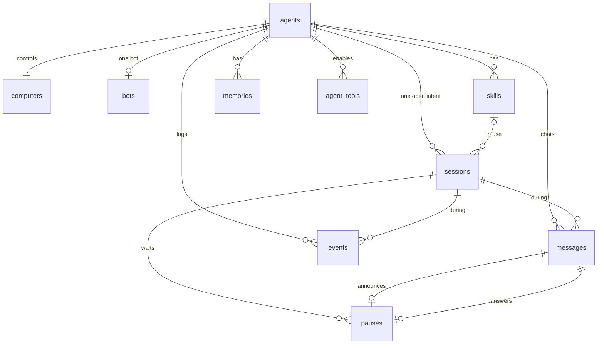

# Data model

Source: [`research/schema.sql`](../../research/schema.sql).

Every primary key is a `bigint identity`: 1, 2, 3. There are no UUIDs in these tables. LangGraph’s checkpoint tables and `factory_session_revocations` sit in the same Postgres and are not Factory tables. See [Checkpoints](#checkpoints).

## Tables

**computers.** The machine this agent controls. One row per agent. `kind` is `mac` or `vm`. A Mac uses `provider` `local`. A VM uses `daytona`, `azure`, or another provider name. `last_seen_at` is the only heartbeat, written by that computer’s connector. Recent means online. The connector credential is not a column.

**agents.** The Factory list. Name, description, system prompt, avatar color, and tags. `computer_id` is unique: this agent’s one computer. `memory_enabled` is the memory switch. `memory_preferences` is the list of `{ "key", "label", "enabled" }`. The row stays when that computer is off. There is no user table and no workspace table. One person owns this Factory, and every agent row is in scope for that person’s bearer.

**bots.** One row per agent (`agent_id` is unique). Telegram username, Telegram’s own bot id, and the person’s `chat_id`. The bot token is not a column. `connected` means `chat_id` is set. Setup binds the token outside this table and fills `username` and `telegram_bot_id`. Unbind clears `chat_id`, `username`, and `telegram_bot_id`.

**skills.** Instructions for one agent. Name, description, and body. The person can create, edit, and delete a skill. The agent sets `sessions.skill_id` when it follows one.

**memories.** Notes for one agent. `body` is the first line. `detail` is the second line. The Memory screen deletes a row. The agent inserts a row when it learns something. The screen has no create button.

**agent_tools.** Four switches, one row per tool: `browser`, `clicks`, `files`, `sap`. `enabled` is the switch. `files` is the file specialist. A new agent starts with `browser`, `clicks`, and `files` enabled, and `sap` disabled.

**sessions.** One intent for this agent, on its computer. `computer_id` is that same computer: `(agent_id, computer_id)` references `agents (id, computer_id)`. Status is `running`, `paused`, `done`, `error`, or `cancelled`. A partial unique index allows only one `running` or `paused` session per agent, and the same for that computer. The two indexes are one lock, because the agent and the computer are one pair. `done`, `error`, and `cancelled` set `finished_at` and release the lock. Older sessions stay as history.

`skill_id` is the skill this intent is following. `page_url` and `page_title` are the page the browser is on. The connector’s heartbeat copies `computers.last_seen_at` onto `heartbeat_at` while the session is open. There is no second heartbeat writer.

`live_jti` and `live_expires_at` are the one desktop link for this open session. Replacing `live_jti` revokes the previous link. Every Factory replica reads this row. The signed token itself is not stored.

**messages.** The Telegram thread. `role` is `user` or `agent`. A message may point at the session it happened during. `pause_id` is set on the agent message that announced a pause. The person’s reply does not use `pause_id`.

**pauses.** A sensitive step. `question` is what the agent is waiting on. Status is `waiting`, `answered`, or `cancelled`. Only one `waiting` pause per session. `will_do` and `will_not` are lists of `{ "title", "detail" }`, written by the agent when it pauses. `answered_message_id` is the reply in the chat that releases a `waiting` pause. Cancel leaves `answered_message_id` null and sets status `cancelled`.

**events.** The Activity timeline. `kind` is `said`, `tried`, or `decided`.

## What is not a table

| On screen | How it is read |
|---|---|
| Workflow canvas | The agent, its skill in use, and its tools. The shape does not vary per agent. |
| Connections | Telegram from `bots`. This agent’s computer from `computers.last_seen_at`, `kind`, and `provider`. The browser from the open session and the `browser` tool. |
| Computer pill | `computers.last_seen_at`. |
| Live desktop | Not stored. |
| Pause “will do” / “will not do” | `pauses.will_do` and `pauses.will_not` on the waiting pause. |
| Browser page | `sessions.page_url` and `sessions.page_title`. |

## Checkpoints

LangGraph checkpoints are in this same Postgres and are not one of the ten tables. They hold the run: tool arguments, page text, and anything the model echoed. The same key names are redacted there as in traces: `api_key`, `authorization`, `password`, `secret`, `token`, `cookie`, and keys ending in `_token`, `_secret`, `_password`, or `_api_key`. Screenshots are not written into a checkpoint.

A thread’s checkpoint lives while its session is `running` or `paused`. When that session becomes `done`, `error`, or `cancelled`, the Factory deletes that thread’s checkpoints. The transcript that remains is `messages` and `events`.

## Not stored

Bot tokens, the connector credential, the Factory access key, the Factory session secret, the live-link signing key, passwords, and keystrokes from the live desktop. `factory_session_revocations` stores only the `jti` of a logged-out bearer and when that bearer would have expired.
