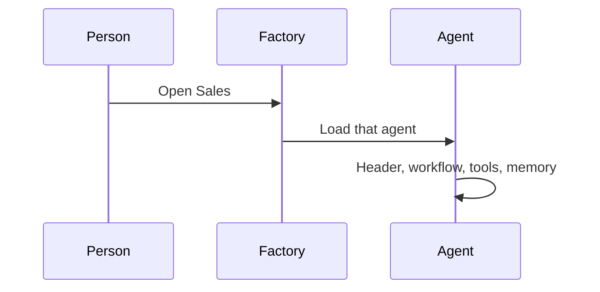
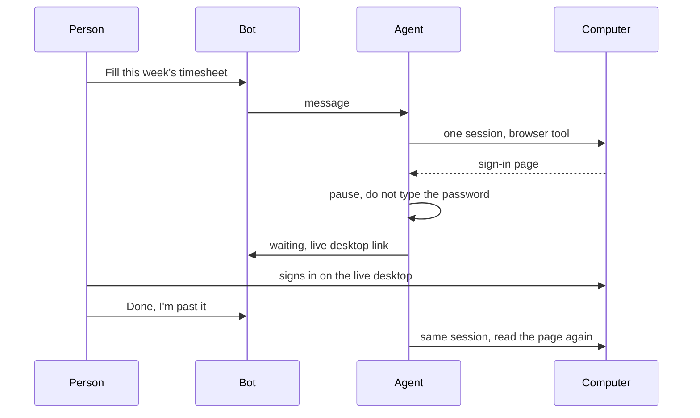
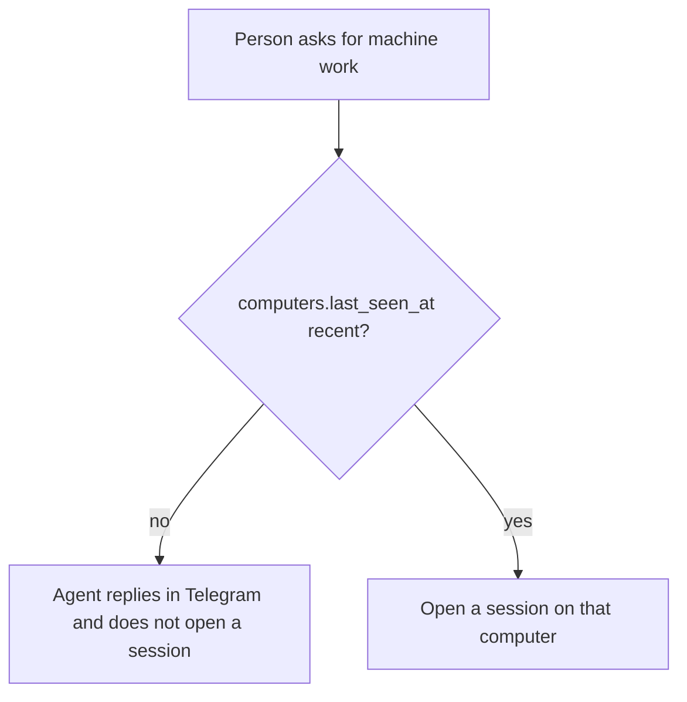

# Flows

The sample throughout is Office filling this week’s MyWipro timesheet on its Mac. Sales and Coder use the same shapes, each on its own computer, with no open intent.

## Open an agent

Factory lists agents. Each agent has its own computer. Opening one sets the Agent section to that id. Memory, skills, activity, and the pause badge all follow `agent_id`. **New agent** inserts an `agents` row, the one `computers` row it controls, a `bots` row, and four `agent_tools` rows (`browser`, `clicks`, `files`, `sap`), then opens it.

## A run that has to pause

What gets written:

1. A `messages` row for the ask (`user`).
2. A `sessions` row, status `running`, title of the intent. `computer_id` is this agent’s computer. This is the only open session for that agent.
3. `events` for what it said, what it tried, and the decision to pause.
4. A `pauses` row, status `waiting`, with `will_do` and `will_not`. `sessions.status` is set to `paused`. The agent message that announced the pause sets `messages.pause_id`.
5. The person’s “I’m past it” is a `messages` row. That row does not set `pause_id`. The pause stores it as `answered_message_id` and becomes `answered`. The session returns to `running`. This step waits if the connector is quiet.

The live desktop does not write a row. The agent continues only because of the reply in the chat. That reply is the only release. There is no separate approve or reject.

Signing in does not put a password in `messages`, `events`, or anywhere else.

The same shape covers a file delete, an overwrite, a raw click, and a site outside `domain_allowlist`. Each one pauses. The person answers in the thread.

## Session states

The open session is the lock. `running` and `paused` hold `sessions_one_open_per_agent` and `sessions_one_open_per_computer`. `done`, `error`, and `cancelled` set `finished_at` and release both.

| From | Event | To |
| --- | --- | --- |
| Idle, computer offline | Person sends a message | Stay idle. `201`. Refusal in the thread. No session. |
| Idle, computer online | Person sends a message | `running`. `201`. The response is the user message. |
| `running` | Sensitive step | `paused`. The announcing message sets `pause_id`. |
| `paused`, computer online | Person replies | `running`. Pause `answered`, `answered_message_id` set. |
| `paused`, computer offline | Person replies | Stay `paused`. `201`. The message is kept. Applied when the connector is seen again. |
| `running` | Person sends another message | Stay `running`. `409`. The message is not saved. |
| `running` or `paused` | Person cancels, or a waiting pause is older than 24 hours | `cancelled`. The lock is free. |
| `running` | The work finishes | `done`. |
| `running` | The work fails | `error`. |

A quiet connector does not by itself change the status. It stops the machine from advancing. Another agent is not waiting on this computer.

## The computer is off

The agent, its bot, its skills, and its memory stay readable. `last_seen_at` is the only heartbeat, written by the connector. Going stale on that agent’s computer is the offline state. No session is inserted until that connector is seen again. Another agent, on its own computer, is unaffected.

A pause that was already waiting stays `waiting`. The person’s reply is stored and is not applied until its connector dials out. The session stays the open intent until that happens, until the person cancels, or until the pause is 24 hours old.
