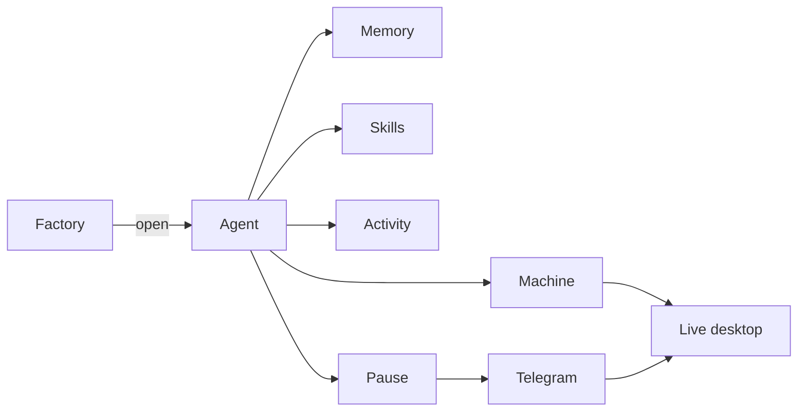

# Screens

The working surface is one shell, [`research/index.html`](../../research/index.html). Factory lists agents. Opening one loads it into the Agent section. Chat and the live desktop are separate pages.

## Factory

Lists every agent. Each card is one agent and the one computer it controls. The sample is Office on a Mac. Sales is the same shape on its own computer, a VM when that agent is the enterprise case. Coder is a third agent with a third computer.

Each card shows the name, a one-line job, a status (Paused or Idle), and a tag. **Open agent**, or the name in the sidebar, loads that agent. **New agent** adds a card and opens it.

Factory reads `agents`. The card shows that agent’s computer, its `kind`, and whether its connector is online.

## Agent

Header: name, description, Save, Test, Open desktop. Test opens the Telegram mock. Open desktop opens the live screen.

Tabs under the header are Memory, Skills, Activity, Pause, and Machine. The Builder tab is the agent itself.

### Builder

The run bar names the open intent, or says the agent is idle.

The canvas is a fixed shape, not a saved graph:

1. Trigger — a Telegram message.
2. The agent — decide, and refuse if its computer is offline.
3. A stack of Memory, the skill in use, and Pause.
4. Reply — back to the same chat.

The right side is Agent details (name, description, color, computer, tags) and the system prompt.

Under the canvas, three panels:

- **Memory** — on or off, scoped to this agent, with what it is allowed to keep.
- **Connections** — Telegram, this agent’s computer, and the browser. Manage opens Machine.
- **Tools** — Browser, machine clicks, files, and SAP. Each is a switch. SAP starts off. Files is the file specialist and starts on.

### Memory

Notes for this agent. Each row can be deleted. The screen does not create a note. The agent inserts one when it learns it. Reads and deletes `memories`. `detail` is the second line.

### Skills

Instructions written for this agent. The one in use is marked from `sessions.skill_id`, which the agent sets. A skill can be created, edited, and deleted. A new skill has a name, when to use it, and the instructions. Reads and writes `skills`.

### Activity

A timeline for the open intent: what it said, what it tried, and each decision. Reads `events`.

### Pause

Shown when a sensitive step is waiting. The mock is a MyWipro sign-in. The screen states what the agent will do next and what it will not do. It does not approve the step. **Open the chat** is how the person replies. Reads `pauses` and the open `sessions` row.

### Machine

The computer this agent controls, as a page. A Mac for now. A VM, at Daytona, on Azure, or with another provider, in the enterprise case.

- Connector — dialed out, or quiet. On a Mac that is the machine asleep. On a VM that is the connector not seen. The credential stays on the computer. `kind` and `provider` say which machine this is.
- Machine clicks — available, and unused when the browser can already see the page.
- SAP — later, on the same session, if the browser and clicks cannot drive it.
- Browser — the page the agent is looking at.

Reads this agent’s `computers` row, `agent_tools`, and the open session. The page the browser is on is `sessions.page_url` and `sessions.page_title`.

## Telegram

[`research/chat.html`](../../research/chat.html). One bot, one agent. The thread in the mock is the timesheet: the ask, the pause with **Open desktop**, and the reply that the person is past sign-in. That reply is how a pause is released. The live link comes back here too. Reads and writes `messages`. The announcing bubble carries `pause_id`.

## Live desktop

[`research/desktop.html`](../../research/desktop.html). The phone view of this agent’s computer. One screen at a time, tap to click, type from the keyboard. Input is accepted only while the session is paused. The agent stays paused until the person replies in Telegram. Nothing from this screen is stored.

The picture is a JPEG a few times a second on the signed socket from [the API contract](api.md). That socket is the only remote-desktop path. Clicks and keys go back on it, and only while the session is paused. On a Mac the connector injects them with Accessibility. On a VM the connector on that VM does the same. The computer does not listen for VNC. WebRTC is not the path. noVNC stays on localhost inside the browser container and is not served on the public listener.
