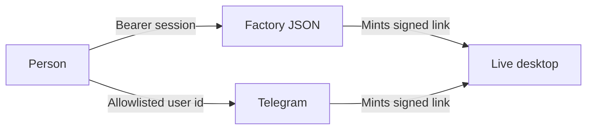
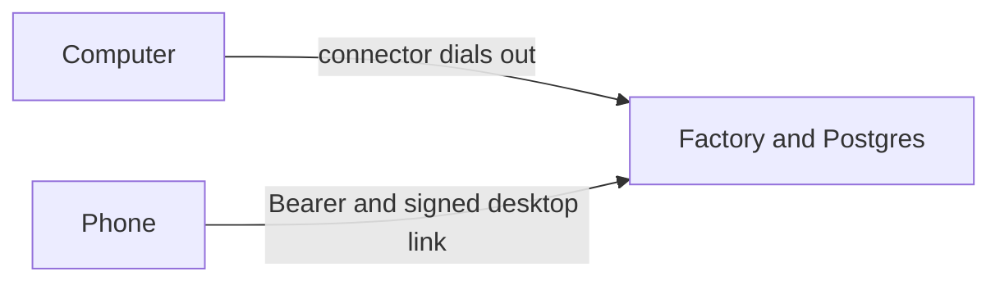

# Security

Three doors, three credentials. None of them is a column in [`research/schema.sql`](../../research/schema.sql).

This page is the Factory contract in [API](api.md). The dashboard routes in `src/control_machine/web/app.py` are a different API and do not use this bearer.



## Factory API

Every Factory JSON route in [API](api.md) requires:

```
Authorization: Bearer <session>
```

The connector routes do not. They use the connector credential. See [The computer](#the-computer).

One person owns this Factory. There is no user table and no workspace table. The bearer is that person’s session, and every agent row is in scope. `POST /api/session` exchanges `factory_access_key` for that bearer. The signing key is `factory_session_secret`. Both stay in server config. Login is refused when either is empty. A missing, bad, or expired session is refused before the handler runs (`401`, `{ "detail": "Missing session." }` or `{ "detail": "Session is invalid or expired." }`). The default lifetime is 12 hours. `DELETE /api/session` writes the bearer `jti` to `factory_session_revocations`, which every replica reads. `require_factory_session` in `src/control_machine/web/session.py` is the check on `GET` and `DELETE /api/session`. A Factory route mounted beside those uses the same check.

With a valid session the person can:

- Read and update this person’s agents, and the memory, skills, tools, activity, and messages that belong to each one. Each agent includes the one computer it controls.
- Create an agent and its computer (`POST /api/agents`).
- Answer a pause by posting a chat message (`POST /api/agents/{agent_id}/messages`).
- Mint a live-desktop link while that agent has an open session and its computer is online (`POST /api/agents/{agent_id}/desktop`). No open session is `409`. The computer offline is `503`. The stream is that computer.

The session cannot:

- Set a computer online or offline. Online means that row’s `last_seen_at` is within 30 seconds.
- Approve a pause from the Pause screen. There is no decide route. The reply in the thread is the only release. A chat line does not resume the machine while the connector is quiet.
- Read another agent’s thread or open another agent’s computer. `GET /api/agents/{agent_id}/messages` is that bot’s chat. The desktop link streams the computer on that same agent. An unknown id is `404`.
- Receive a bot token, the connector credential, a password, or a keystroke. `bot` in the agent response is `id`, `username`, and `connected`.

Other HTTP checks:

| Status | When |
| --- | --- |
| 400 | The body fails (`name` empty, tool name outside `browser`, `clicks`, `files`, `sap`). |
| 401 | The bearer is missing, bad, or expired. |
| 404 | The id is not an agent in this Factory. |
| 409 | `POST /api/agents/{agent_id}/messages` while a session is already `running`, or a desktop link with no open session. |
| 503 | A desktop link while that computer is offline. |

A message while the computer is offline and no session is open is `201`. The agent replies in the thread and does not insert a session. A reply to a `waiting` pause while the computer is offline is also `201`, and the pause stays `waiting` until the connector is seen. Those two are not `409`.

Each request is checked again:

1. Credential. A missing bearer stops the call. `require_factory_session` does this. Connector calls are checked against the connector credential instead.
2. Scope. `{agent_id}` is an agent in this Factory. Its computer is the one row `agents.computer_id` points at. Memories, skills, events, tools, and messages load by that `agent_id`. The desktop stream for that agent is that computer. `in_workspace` is that check.
3. Machine work. A new session is inserted only when that computer’s `last_seen_at` is recent (`computer_online`, 30 seconds) and `sessions_one_open_per_agent` allows it. `new_session_block` is the `409` for a second intent on an agent that is already `running`. Another agent’s session is on another computer and does not take this slot. A tool name outside `browser`, `clicks`, `files`, and `sap` is `400`. A tool with `agent_tools.enabled` false is not called. A waiting pause stays waiting until the message post answers it, and that answer is applied on the machine only after the connector is seen. `done`, `error`, `cancelled`, and the 24-hour pause timeout are what release the lock.

`public_bot` is the bot object on the agent response: `id`, `username`, and `connected`. The token is not a field. These checks live in `src/control_machine/access.py`.

## Telegram

The bot token is given once, at `POST /api/agents/{agent_id}/bot`, and stays outside `bots`. `DELETE /api/agents/{agent_id}/bot` unbinds that bot and clears `chat_id`. `src/control_machine/telegram.py` accepts a Telegram user id only when it is listed in `telegram_allowlist`. An empty list admits nobody. The first `/start` stores `chat_id`. That chat is the only conversation for that agent. A group chat is not a second conversation.

Telegram does not present the Factory bearer. After the allowlist check, the bridge may mint a desktop link the same way the Factory does.

## Live desktop

`POST /api/agents/{agent_id}/desktop` returns `{ url, expires_at }` with `?t=<signed-token>`. The socket `wss://host/live/desktop/stream?t=...` accepts that token. It does not accept the bearer.

The token is HMAC-SHA256 over the open session’s id, the expiry, and a `jti`, compared in constant time. The signing key is `live_link_secret`. The Factory refuses to sign when that key is empty. It does not fall back to the bot token or to a fixed string. The current `jti` and expiry are stored on the session (`live_jti`, `live_expires_at`). A bad signature, a `jti` that is not the one on that session, or an expired token closes the socket. Minting a new link replaces `live_jti`, which revokes the previous link for every replica, including after a restart. Lifetime is 15 minutes. The token is a query parameter on the socket only. It is not written to a log.

The viewer cookie `cm_live` is `HttpOnly`, `SameSite=Lax`, `Secure` when the public URL is HTTPS, path `/live`, and it expires with the token.

Clicks and typed text are applied only while that session is `paused`, and then discarded. They are not written to `messages` or `events`. The computer does not run a VNC server. noVNC stays on localhost inside the browser container. It is not a public route and it is not a second desktop protocol. The phone uses the JPEG socket.

## What is not stored

Bot tokens, the machine credential, passwords, and keystrokes from the live desktop. See [Data model](data-model.md).

Traces in `src/control_machine/tracing.py` replace values whose key is `api_key`, `authorization`, `password`, `secret`, `token`, or `cookie`, and keys ending in `_token`, `_secret`, `_password`, or `_api_key`. Screenshots are dropped from traces. LangGraph checkpoints in the same Postgres get the same redaction, and they are deleted when the session reaches `done`, `error`, or `cancelled`.

## What the agent is allowed to do

These are the checks the agent follows. File and browser limits that already ship are in `src/control_machine/agent.py` and `src/control_machine/fs.py`. The release is always the reply in the thread. There is no approve, reject, or edit body.

- Passwords, payment details, one-time codes, and captchas stop the run. The browser and desktop prompts call `ask_user` and wait. An authentication page (“approve sign in”, an MFA number, an authenticator, a verification code) stays blocked. The number, when one is on screen, is included in the question.
- This agent runs one open intent on its computer. A second job on that same agent does not start. Another agent has its own computer and can run at the same time.
- While that agent’s connector is quiet, machine work is refused in the chat.
- Browser, files, and desktop are separate specialists. The supervisor does not inherit their tools.
- Browser and desktop specialists cannot read or write `/home` or `/memories/`. The file specialist is the one that touches this agent’s computer.
- Home is mounted at `/home`. Paths outside that root are rejected. Reads and writes are denied for `.ssh`, `.gnupg`, `.aws`, `.config/gcloud`, `Library/Keychains`, `Library/Cookies`, `Library/Mail`, `Library/Accounts`, `Library/IdentityServices`, and for names such as `.env`, private keys, `.netrc`, `.pgpass`, `credentials.json`, and `service-account.json`. Suffixes `.pem`, `.p12`, `.pfx`, `.key`, and `.ovpn` are denied. Extra prefixes come from `filesystem_deny`.
- Deleting a host file, overwriting an existing one, editing one, a raw screen click (`browser_click_xy`), or a navigation outside `domain_allowlist` pauses the session. The person releases it by replying in the thread. The `files` tool is subject to the same `enabled` check as `browser`, `clicks`, and `sap`.
- An empty `domain_allowlist` allows no site. The person adds the hosts this agent may open. A navigation outside that list pauses, the same way a sign-in does.
- Memory is per agent. The Factory can switch it off and choose what it keeps. Notes can be deleted.

## The computer

Each agent controls one computer. The agent loop runs in the Factory. The connector on that computer dials out, authenticates with the credential that stays on the computer, and writes `computers.last_seen_at`. Tool calls travel back down that same outbound stream. That is the only way a decision becomes a click. No inbound port is opened for VNC. The protocol is [Connector](api.md#connector).

| `kind` | `provider` | Where it runs |
| --- | --- | --- |
| `mac` | `local` | The person’s Mac. This is the computer for now. |
| `vm` | `daytona`, `azure`, or another name | A VM. The provider is the host. Daytona, Azure, and any later host use this same row. |

The provider does not replace the bearer, the Telegram allowlist, the signed desktop link, or the connector. A VM is still the computer that agent controls. Chrome, the screen, the files, and the connector credential stay on that VM. Passwords are still typed on the signed socket and still not stored.

## Azure or Utho

The cloud hosts the platform. The computer stays the machine that does the work. The connector dials out. Azure and Utho do not replace the bearer, the Telegram allowlist, or the signed desktop link.



What moves: the Factory API, the Telegram pollers, and Postgres. The live-link signing key, the Factory access key, the Factory session secret, and the bot tokens move into the cloud secret store. They stay out of the tables.

What stays on the computer: Chrome, the screen, the files, and the connector credential. No inbound port is opened for VNC.

Both clouds:

- HTTPS for the Factory API and WSS for the JPEG socket.
- Postgres on a private address, TLS, reachable from the Factory.
- Public surface is port 443. The desktop socket still rejects a missing, forged, expired, or revoked token.
- Secrets are injected when the process starts. They are not baked into the image and not written into Postgres.

Azure: the API on Container Apps or App Service with WebSockets enabled, Postgres Flexible Server with public access off, Key Vault and a managed identity for `live_link_secret`, `factory_access_key`, `factory_session_secret`, bot tokens, and the model key. Each computer’s path is outbound to that API. An Azure VM that an agent controls is a `computers` row with `kind` `vm` and `provider` `azure`. It is not this platform.

Utho: the API on a compute instance or Kubernetes inside a VPC, managed PostgreSQL on the private hostname, and a firewall that publishes only 443. The load balancer passes the WebSocket through. The same secret values live in the instance or cluster secret store. Utho’s console key (`Authorization: Bearer` on `api.utho.com`) is for their API, separate from the Factory session.
